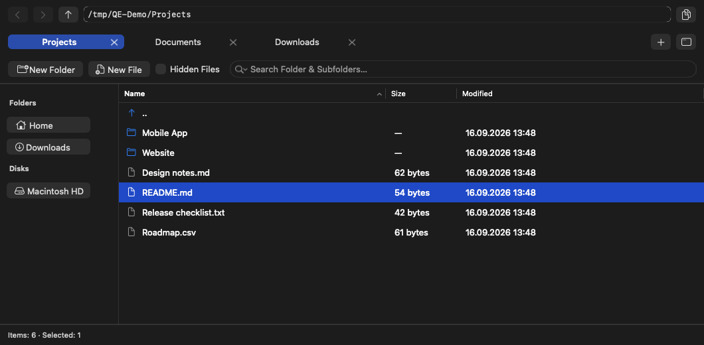
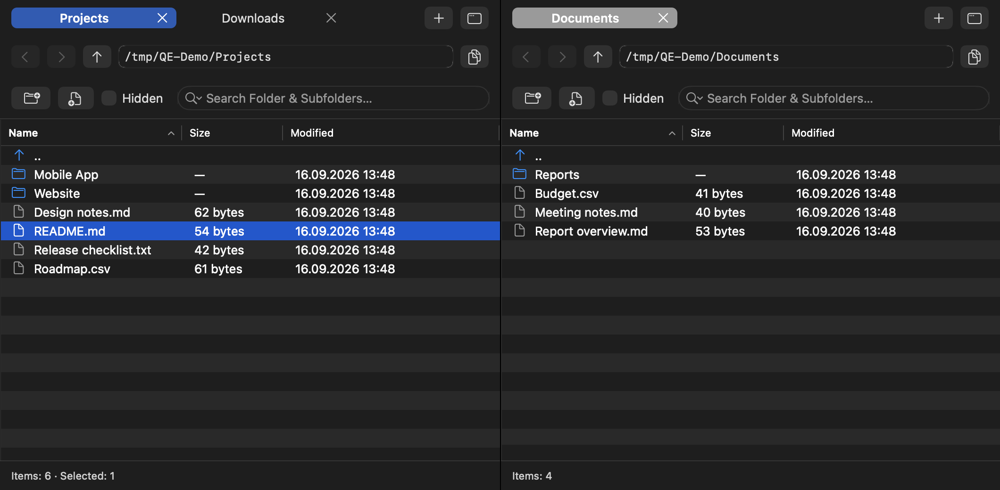
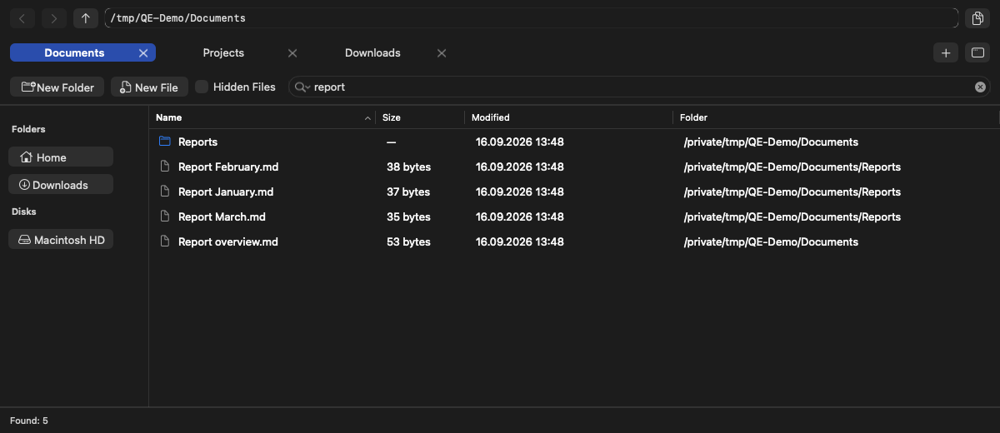

# QE

A native file manager for macOS with tabs, independent windows, split panes, file search, and ZIP/7z archives.

Requires **macOS 26 or later** and **Apple Silicon (M1 or later)**. The interface is in English.



## Screenshots

**Split panes** display two folders in one window, each with its own tabs and selection.



**Search results** include the containing folder for matches found in subfolders.



## Installation

Homebrew installation:

```sh
brew install --cask qzmi4meister/tap/qe
open -a QE
```

Update:

```sh
brew update
brew upgrade --cask qzmi4meister/tap/qe
```

Uninstall:

```sh
brew uninstall --cask qzmi4meister/tap/qe
```

Uninstalling preserves preferences, saved tabs, and file associations. Removal with `brew uninstall --cask --zap qzmi4meister/tap/qe` also deletes these settings. User files are preserved in both cases.

For manual installation, [Releases](https://github.com/qzmi4meister/qe/releases) provides a ZIP containing `QE.app`, which belongs in Applications. `SHA256SUMS` contains the archive checksum.

## Windows and navigation

- **Windows** open through **File → New Window** or the window button at the right edge of the tab row. A new window starts in the current folder. Windows and their tab paths are restored at launch.
- **Tabs** open with **+**, which always follows the last tab. When space runs out, tabs shrink to fit while keeping **+** visible, without horizontal scrolling. Close a tab with its cross or **⌘W**; the cross is hidden on very narrow tabs. **Move Tab to New Window** is available in the tab context menu and the **Window** menu. Moving preserves navigation history, sorting, selection, scroll position, and an active search. Another tab or pane must remain, and the source pane must have no file operation running.
- **Split Tab** (⌘D) in the Window menu or tab context menu displays the tab in a second pane. With one tab, it creates another tab at the same folder. Each pane has its own tabs, path, search, and selection. Clicking a pane directs keyboard commands to it; its active tab is blue. The divider resizes the panes. **Close Split** (⌘⇧D) combines the tabs into one pane. Closing or detaching a pane’s last tab removes that pane. Split mode and tab paths are restored at launch.
- **Path** is editable at the top of the window. The adjacent button copies the current path; the context menu copies paths of selected items.
- **Go Up**: double-clicking the `..` row opens the parent folder. The row stays above files when sorting and is excluded from file operations. It is hidden at the filesystem root and in search results.
- **Hidden Files** are shown on first launch. The visibility setting is saved.
- **Applications** in the sidebar combines shared and system applications like Finder, including Safari; **Utilities** remains a folder. Apps in `~/Applications` are separate. **Desktop** opens the current user's desktop folder.
- **Custom folders**: click **+** beside **Folders** to add a folder link. Links are shared across windows and panes and survive restarting QE. Right-click a custom link and choose **Remove from Sidebar** to remove it without deleting the folder. Built-in folders cannot be removed. Links store paths: if a folder is moved, renamed, or unavailable, clicking its link offers to remove it or cancel without leaving the current folder.
- **External disks** appear in the sidebar. Removable volumes have an eject button.

## Working with files

- **New Folder / New File** are above the file list. New files are empty; their names can include an extension.
- **Copy / Cut / Paste**, **Copy To… / Move To…**, **Rename**, and **Move to Trash** are in the context menu. **Copy To… / Move To…** open a folder picker, which starts at the other pane’s folder in Split mode.
- **Quick Look** previews selected files without opening their associated application.
- **Drag and drop** into a folder or onto a tab copies files. Holding ⌘ during the drop moves them.
- **Dates** use `dd.MM.yyyy` and 24-hour `HH:mm` time in the local time zone.

When names conflict, the available actions are **Keep Both**, **Skip**, and **Replace**. Replacing a folder replaces it entirely rather than merging its contents. Deletion sends items to Trash.

### Search

Search matches part of a file or folder name and starts on Return. The magnifying-glass menu offers **This Folder** for direct children only and **Include Subfolders** for recursive search, the default. Each pane remembers its scope between launches.

Changing scope reruns the current query. Clearing the field returns to the directory listing. **Show in Folder** appears only during search and opens a result’s parent folder with the item selected.

### Archives

Double-clicking a ZIP or 7z archive extracts it into a folder beside the archive and opens that folder in QE. If the folder already exists, QE chooses a free name. The original archive is preserved.

**Extract…** offers a choice of destination. **Create ZIP…** and **Create 7z…** in the context menu create archives from selected items in the same folder.

### File associations

**Open With…** offers a list of applications; **Other…** opens an application picker. **Always open .txt files in QE with this application** saves the choice for that extension. Double-clicking or choosing **Open** then uses the saved application. For archives, this takes precedence over built-in extraction.

**Reset Application for .txt** restores the system default for that extension. Associations apply within QE and persist between launches. Extension matching is case-insensitive. Files without an extension support a one-time application choice.

## Keyboard shortcuts

| Action | Shortcut |
| --- | --- |
| New folder | ⌘⇧N |
| New file | ⌘N |
| New / close tab | ⌘T / ⌘W |
| Split current tab / close Split | ⌘D / ⌘⇧D |
| Switch active pane in Split (from the file list) | Tab |
| Select tab 1–10 in the active pane | ⌘1…9, ⌘0 |
| New window | ⌘⌥N |
| Go to path | ⌘L |
| Search by name | ⌘F |
| Copy path | ⌘⌥C |
| Show hidden files | ⌘⇧. |
| Refresh | ⌘R |
| Open | Return / Enter or ⌘↓ |
| Go up | ⌘↑ |
| Rename | F2 |
| Quick Look | F3 |
| Copy to folder | F5 |
| Move to folder | F6 |
| Move to Trash (with confirmation) | F8 or ⌘⌫ |

Depending on keyboard settings, F2–F8 may require **Fn / 🌐** to activate the function keys instead of media and system controls.

## Limitations

- Copy cancellation is checked between items. A single large file may finish copying before cancellation takes effect.
- Cancelling an operation preserves already completed items. There is no general undo.
- If an archiver remains blocked on disk access after cancellation, QE keeps its operation active and preserves temporary output. Normal closing stays blocked. Finish other operations before using macOS Force Quit; the archiver and temporary files may remain.
- Password-protected and multipart archives are unsupported.
- Adding an extension to an empty file does not create a Word document, spreadsheet, or other structured format.
- Search operates on names, excludes application-bundle contents, and does not follow symbolic links.

## Support

[GitHub Issues](https://github.com/qzmi4meister/qe/issues) accepts bug reports and suggestions. A file-operation report needs a reproducible example with sample data, the macOS version, and the expected and actual results.

## License

[MIT](LICENSE), © 2026 qzmi4meister. The license is included in the application.
